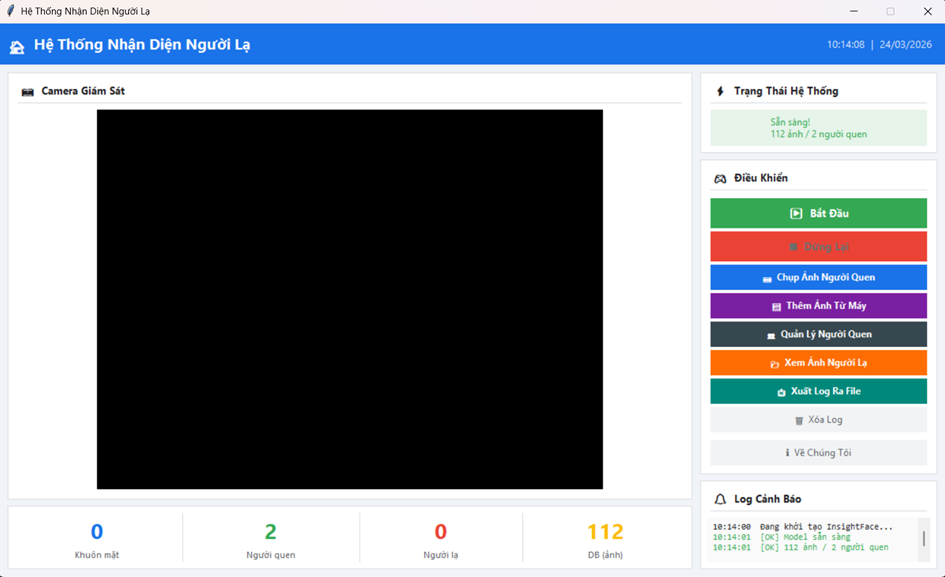
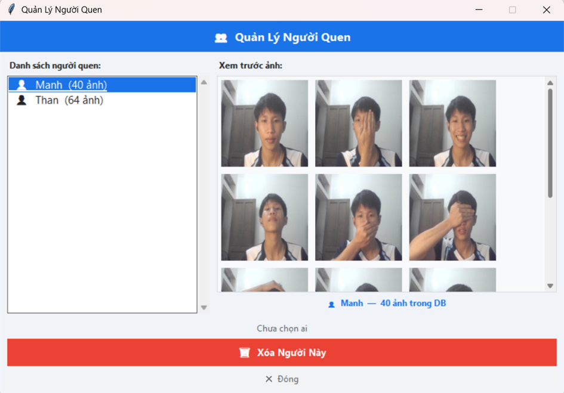
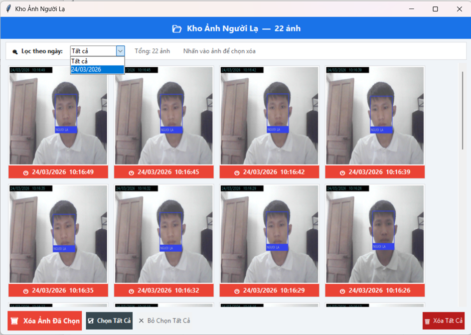
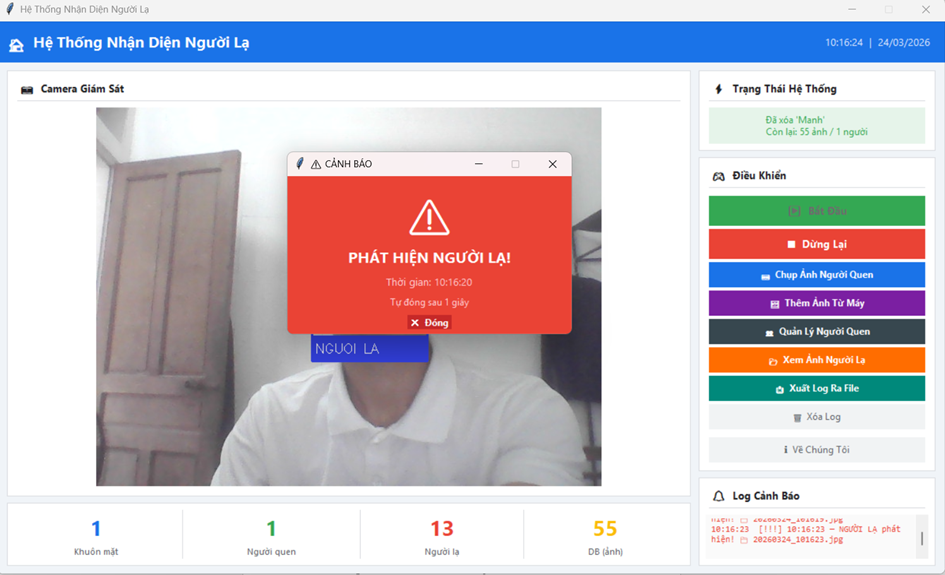

# 🏠 Hệ Thống Nhận Diện Người Lạ Vào Nhà

> Đồ án môn **Thị Giác Máy Tính** — Nhóm 6 — Trường Đại Học Vinh


---

## 📌 Giới thiệu

Hệ thống sử dụng camera realtime để **phát hiện và cảnh báo khi có người lạ** xuất hiện trong khu vực giám sát. Ứng dụng tích hợp giao diện đồ họa trực quan, hỗ trợ quản lý người quen, lưu ảnh bằng chứng và cảnh báo âm thanh + popup tức thì.

---

## 👥 Thông tin nhóm

| Họ và tên | MSSV | Vai trò |
|---|---|---|
| Nguyễn Khánh Duy | ... | Lập trình chính |
| Nguyễn Trọng Mạnh | ... | Giao diện + Testing |
| Hoàng Minh Thắng | ... | Báo cáo + Slide |

- **Giáo viên hướng dẫn:** Nguyễn Thị Minh Tâm
- **Môn học:** Thị Giác Máy Tính
- **Trường:** Đại Học Vinh

---

## 🧠 Giải thích thuật toán

Hệ thống hoạt động theo pipeline 2 tầng:

```
Camera → SCRFD (Detect) → ArcFace (Nhận diện) → So sánh DB → Kết quả
```

### Tầng 1 — SCRFD (Face Detection)
- Phát hiện vị trí khuôn mặt trong frame
- Hoạt động tốt với mọi góc độ, ánh sáng yếu, che khuất một phần
- Trả về bounding box + điểm tin cậy `det_score`
- Chỉ xử lý khuôn mặt có `det_score ≥ 0.5`

### Tầng 2 — ArcFace (Face Recognition)
- Chuyển khuôn mặt thành **vector 512 chiều** (face embedding)
- Mỗi người có một "dấu vân tay số" duy nhất
- So sánh bằng **Cosine Distance** — giá trị càng nhỏ càng giống nhau
- Ngưỡng nhận diện: `cosine_distance < 0.45` → người quen

### Cơ chế Smoothing
Tránh chập chờn bằng cách yêu cầu detect **liên tiếp 2 lần** mới hiển thị khung — loại bỏ false positive tức thời.

### Lưu trữ
Embeddings được cache vào `encodings.pkl` — lần sau khởi động load ngay, không xử lý lại ảnh.

---

## 🖥️ Giao diện

> *(Chụp màn hình giao diện và thay thế ảnh bên dưới)*

### Màn hình chính


### Cửa sổ quản lý người quen


### Kho ảnh người lạ


### Cảnh báo popup


---

## 📁 Cấu trúc thư mục

```
face_final/
│
├── app.py                  # File chính — giao diện + toàn bộ logic
│
├── known_faces/            # Ảnh người quen (tự tạo khi chạy)
│   ├── NguyenVanA/
│   │   ├── NguyenVanA_1.jpg
│   │   └── NguyenVanA_2.jpg
│   └── TranThiB/
│       └── TranThiB_1.jpg
│
├── unknown_log/            # Ảnh người lạ tự động lưu (tự tạo khi chạy)
│   └── 20260323_143215.jpg
│
├── encodings.pkl           # Cache embeddings (tự tạo khi chạy)
│
└── README.md
```

> **Lưu ý:** Chỉ cần `app.py` là đủ để chạy. Các thư mục còn lại tự tạo khi sử dụng.

---

## ⚙️ Cài đặt môi trường

### Yêu cầu hệ thống
- Windows 10/11 (64-bit)
- Python 3.10
- GPU NVIDIA (khuyến nghị) — CPU vẫn chạy được nhưng chậm hơn
- Webcam

### Bước 1 — Tạo môi trường Anaconda

```bash
conda create -n face_final python=3.10 -y
conda activate face_final
```

### Bước 2 — Cài thư viện

```bash
pip install opencv-python
pip install numpy pillow
pip install onnxruntime-gpu==1.20.0
pip install insightface
```

### Bước 3 — Kiểm tra

```bash
python -c "import cv2; import insightface; import onnxruntime as ort; print('OK!'); print(ort.get_available_providers())"
```

Kết quả mong đợi:
```
OK!
['TensorrtExecutionProvider', 'CUDAExecutionProvider', 'CPUExecutionProvider']
```

---

## 🚀 Hướng dẫn chạy

### Chạy ứng dụng

```bash
conda activate face_final
cd D:\face_final
python app.py
```

### Lần đầu sử dụng

```
1. Nhấn "📷 Chụp Ảnh Người Quen" → nhập tên → chụp 15+ ảnh đa góc
   HOẶC
   Nhấn "🖼 Thêm Ảnh Từ Máy" → chọn ảnh có sẵn từ máy tính

2. Nhấn "▶ Bắt Đầu" → hệ thống tự động xử lý ảnh và bắt đầu theo dõi

3. Khi phát hiện người lạ:
   → Popup cảnh báo đỏ hiện lên
   → Âm thanh beep 3 lần
   → Ảnh tự động lưu vào unknown_log/ có khung + timestamp
   → Log cảnh báo ghi lại thời gian
```

### Các tính năng chính

| Tính năng | Mô tả |
|---|---|
| ▶ Bắt Đầu | Bật camera, bắt đầu nhận diện realtime |
| ■ Dừng Lại | Tắt camera |
| 📷 Chụp Ảnh Người Quen | Chụp ảnh trực tiếp trong app |
| 🖼 Thêm Ảnh Từ Máy | Chọn ảnh từ máy tính |
| 👥 Quản Lý Người Quen | Xem, xóa người trong DB — có xem trước ảnh |
| 📂 Xem Ảnh Người Lạ | Gallery ảnh bằng chứng, lọc theo ngày, xóa từng ảnh |
| 📤 Xuất Log Ra File | Lưu lịch sử cảnh báo ra file .txt |
| ℹ Về Chúng Tôi | Thông tin nhóm |

---

## 🛠️ Công nghệ sử dụng

| Công nghệ | Phiên bản | Mục đích |
|---|---|---|
| Python | 3.10 | Ngôn ngữ lập trình |
| InsightFace | 0.7.3 | Framework nhận diện khuôn mặt |
| SCRFD | — | Phát hiện khuôn mặt (tầng 1) |
| ArcFace (w600k_r50) | — | Nhận diện danh tính (tầng 2) |
| OpenCV | 4.13 | Xử lý video, vẽ bounding box |
| Tkinter | built-in | Giao diện đồ họa |
| ONNXRuntime-GPU | 1.20.0 | Chạy model trên GPU NVIDIA |
| Pillow | — | Xử lý ảnh |

---

## ⚠️ Lưu ý

- Lần đầu chạy InsightFace sẽ **tự tải model** (~500MB) — cần internet
- Nên chụp **15-20 ảnh/người** với nhiều góc độ khác nhau để nhận diện tốt hơn
- GPU NVIDIA cho kết quả nhanh hơn CPU khoảng 5-10 lần

---

## 📈 Hướng phát triển

- Tích hợp SQLite để lưu lịch sử cảnh báo lâu dài
- Hỗ trợ nhiều camera cùng lúc
- Gửi thông báo qua Telegram/Email khi phát hiện người lạ
- Triển khai trên Raspberry Pi cho hệ thống nhúng
- Nâng cấp lên InsightFace RetinaFace để cải thiện góc nghiêng

---

## 📄 License

MIT License — Sử dụng tự do cho mục đích học tập và nghiên cứu.
